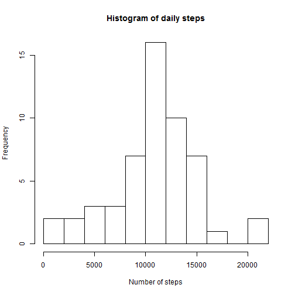
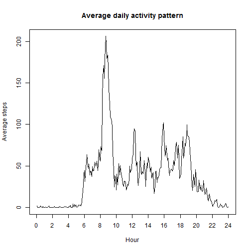
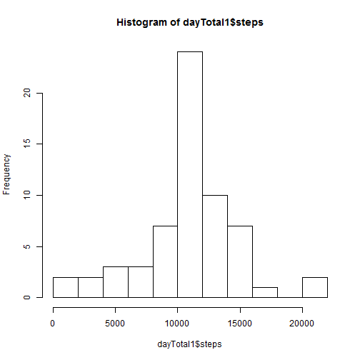
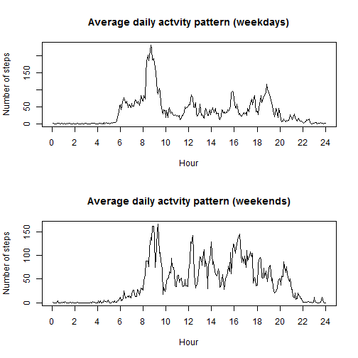

## Loading and preprocessing the data

The csv file containing the data should be in the working directory. The following 
code reads the file. It also converts the date variable from text to date format. 


```r
activity <- read.csv("activity.csv")
activity$date <- as.Date(activity$date)
```


## What is mean total number of steps taken per day?

The following code calculates the total number of steps taken during each day and creates
a histogram of steps taken. It then calculates and displays the mean and median total
number of steps taken daily.


```r
dayTotal <- aggregate(steps ~ date, data = activity, na.rm= TRUE, FUN = "sum")

hist(dayTotal$steps, breaks = "FD", main="Histogram of daily steps", xlab = "Number of steps")
```

 

```r
mean_dayTotal <- mean(dayTotal$steps)
median_dayTotal <- median(dayTotal$steps)  
mean_dayTotal
```

```
## [1] 10766.19
```

```r
median_dayTotal
```

```
## [1] 10765
```


## What is the average daily activity pattern?

The code snippet below calculates the average daily activity pattern by calculating 
average across all days for each 5 minute interval.


```r
activity$linear <- rep(1:288, 61)

timeSeries <- aggregate(steps ~ linear, data= activity, mean)


plot(timeSeries$linear, timeSeries$steps, type = "l", main = "Average daily activity pattern",
     ylab = "Average steps", xlab="Hour", xaxt="n")
axis(side=1, at=seq(0, 288, by = 24), labels = seq(0,24, by=2))
```

 

This section reports the maximum number of steps averaged across all days for each 5 minute interval
and reports the time in original format for the time maximum number of steps taken.


```r
timeSeries$interval <- activity$interval[1:288]
maxInterval <- which(timeSeries$steps == max(timeSeries$steps))
timeSeries$steps[maxInterval]
```

```
## [1] 206.1698
```

```r
timeSeries$interval[maxInterval]
```

```
## [1] 835
```


## Imputing missing values

The code below calculates and reports the total number of missing values.


```r
missing <- is.na(activity$steps)
sum(missing)
```

```
## [1] 2304
```

My strategy for filling in the missing values is based on replacing the missing values with the mean for that 5-minute interval calculated across all days. This strategy makes sense as there are cases where the entire day contains missing values and therefore the missing values cannot be calculated for those days.


```r
activity1 <- activity
meanInterval <- aggregate(steps ~ linear, data = activity1, FUN = "mean", na.rm = TRUE)

for(i in 1:length(activity1$steps)){
      if(is.na(activity1$steps[i])){
            interval <- activity1$linear[i]
            activity1$steps[i] <- meanInterval$steps[interval]
      }
}
```

This section create a histogram of the total number of steps taken each day and displays the mean and median total number of steps per day.


```r
dayTotal1 <- aggregate(steps ~ date, data = activity1, na.rm= TRUE, FUN = "sum")
hist(dayTotal1$steps, breaks = "FD")
```

 

```r
mean_dayTotal1 <- mean(dayTotal1$steps)
median_dayTotal1 <- median(dayTotal1$steps)
mean_dayTotal1
```

```
## [1] 10766.19
```

```r
median_dayTotal1
```

```
## [1] 10766.19
```

The values obtained for the dataset with missing values and the corrected dataset
for mean and mddian total number of steps are very close to each other. Therefore,
imputing missing data using the method of replacing by values averaged for the interval
across all days does not effect the dataset extensively. 

## Are there differences in activity patterns between weekdays and weekends?

In this section the average daily activity pattern between weekdays and weekends are
compared. 


```r
activity1$day <- weekdays(activity$date)
activity1$wkDay <- factor(ifelse(activity1$day == "Saturday" | activity1$day == "Sunday", "weekend", "weekday"))

activity_day <- split(activity1, activity1$wkDay)
weekdays <- activity_day[[1]]
weekends <- activity_day[[2]]

par(mfrow= c(2,1))
# Plot for the weekdays
ts_weekdays <- aggregate(steps ~ linear, data= weekdays, mean)

plot(ts_weekdays$linear, ts_weekdays$steps, type = "l", main = "Average daily actvity pattern (weekdays)",
     ylab = "Number of steps", xlab="Hour", xaxt="n")
axis(side=1, at=seq(0, 288, by = 24), labels = seq(0,24, by=2))

# Plot for the weekends
ts_weekends <- aggregate(steps ~ linear, data= weekends, mean)

plot(ts_weekends$linear, ts_weekends$steps, type = "l", main = "Average daily actvity pattern (weekends)",
     ylab = "Number of steps", xlab="Hour", xaxt="n")
axis(side=1, at=seq(0, 288, by = 24), labels = seq(0,24, by=2))
```

 

